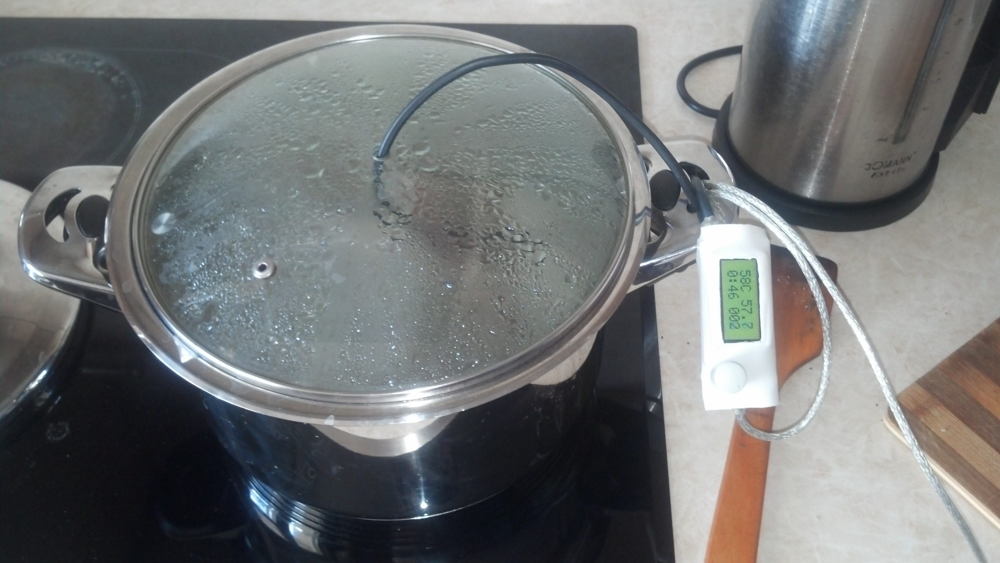

# s-thermo
Sous-vide thermostat based on Atmega8, 2x8 HD44780U compatible LCD and DS18B20 digital thermometer

Features:
	* Can be reprogrammed by USB interface
	* If plugged in a USB port, can act as a thermometer
	* PID regulator accurately tuned for triac control of water heater
	* Simple user interface controlled by only one encoder with push button
	* Precise control of heater power
	* Triac switches only at zero crossing of AC voltage which minimizes EMI
